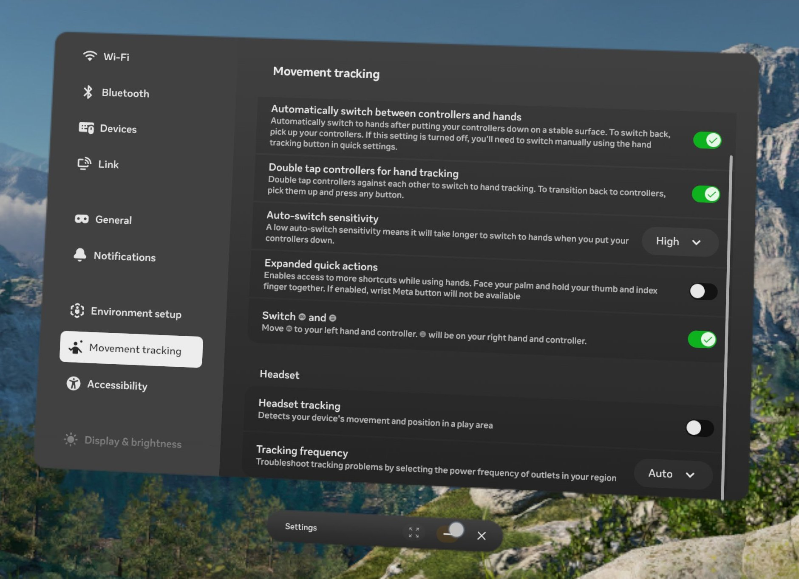
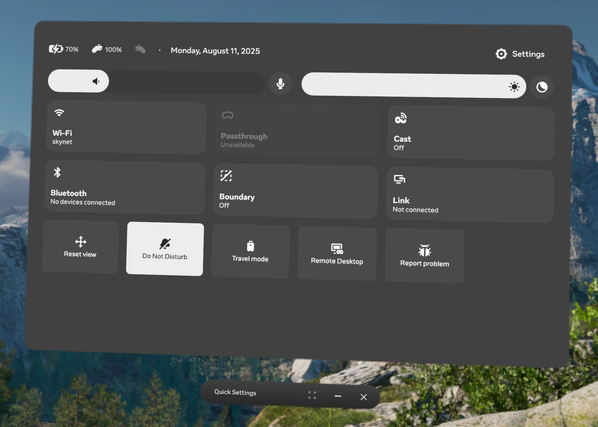
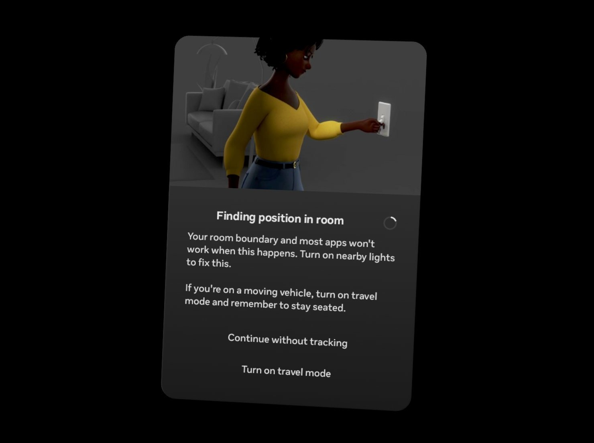

# BASEline XR

BASEline Mixed Reality.

Uses the Meta Quest 3 headset to overlay a 3D terrain model over the real world.
Location comes from a FlySight2 bluetooth GPS unit.
Orientation comes from the Quest headset.

## Ground Setup

1. Pair FlySight with Quest:
   - Double-tap FlySight button (LED should be pulsing)
   - Quest Settings > Bluetooth > Scan
   - Click your FlySight in the list to pair it with the quest
2. Install app:
   - Install Android Studio
   - Enable developer mode in Quest settings
   - Open BASElineXR project in Android Studio
   - Click run button ▶️ to install
3. Configure Quest (IMPORTANT):
   - Travel Mode: DISABLED
   - Settings > Movement Tracking > Headset Tracking: DISABLED
4. Verify you are able to receive location data from FlySight
   - Reboot may be required after pairing

### Headset Tracking

You should disable headset tracking.

Disabling headset tracking puts the device in 3DOF instead of 6DOF mode. [[source]](https://www.meta.com/en-gb/help/quest/598701621088668/)
This has the unfortunate side-effect of disabling pass-through on the quest home screen (but passthrough still works in BASEline).
Disabling headset tracking prevents the Tracking Lost screen.

If "Headset Tracking" is enabled, the device will lose tracking in flight (or on the plane) and show the tracking lost screen.

WARNING: When the headset loses tracking, it will show a popup **AND DISABLE PASSTHROUGH CAMERA** until you click "continue without tracking".

If you're on the plane, you can use a controller to click "continue without tracking".
But it can be hard to hit, and it is important that you do NOT click "turn on travel mode".

WARNING: Do NOT turn on travel mode! It will disable headset rotation that is needed for BASElineXR. 

## Flight Setup

WARNING: The Quest does NOT know which way is north in relation to the direction you are looking.

This means that the headset and the 3D model are by default NOT aligned.
This results in unexpected behavior where you flying forward results in terrain approaching from the side, or backwards.

BASElineXR has a complicated system to fix alignment before flight.
The blue arrow is always below you, and points toward what the headset _thinks_ is the direction of flight.

**The blue arrow MUST point toward the front of the plane before exit.**

1. On final approach, put on headset
2. Click on BASElineXR HUD to show options menu
3. LOOK at the nose or tail of the plane and click Nose or Tail button
4. Use +/- 5° to fine tune the orientation
5. Click on BASElineXR HUD again to hide options menu

Notes:

 - Left controller hamburger is the ONLY way to force return to home.
 - Meta button + long-press trigger to start/stop recording.

## Imagery

Source: swisstopo
