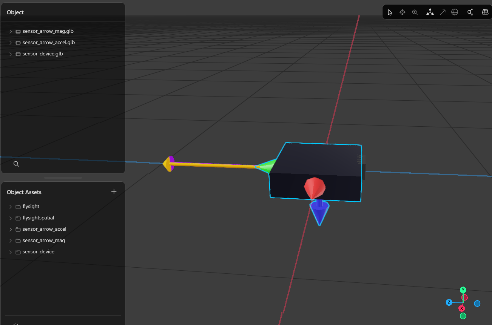
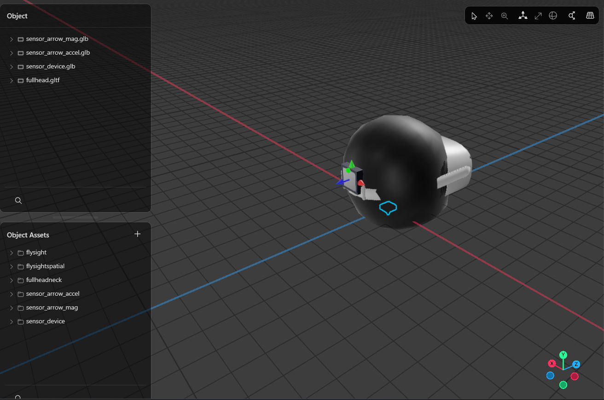

# BASElineXR Coordinate Systems

## The Four Frames in Play

| Name | X | Y | Z | Handedness | Used in |
|---|---|---|---|---|---|
| **Meta Spatial** | East | Up | South | Right | Meta SDK — required for all rendering |
| **BASElineXR (current)** | East | Up | North | **Left** | `GeoUtils`, `KalmanFilter3D`, `GpsToWorldTransform` |
| **GPS/ENU** | East | North | Up | Right | `MLocation.vE/vN/climb`, FlySight output |
| **NED** | North | East | Down | Right | Aerospace standard — `WSE.java` uses internally |

---

## Where GPS Data Enters the System

GPS measurements arrive as `MLocation` with named fields:

| GPS field | Meaning | Units |
|---|---|---|
| `lat`, `lon` | Geographic position | degrees WGS84 |
| `alt` | Altitude MSL | metres |
| `vN` | Velocity northward | m/s |
| `vE` | Velocity eastward | m/s |
| `climb` | Velocity upward | m/s |

`GeoUtils.calculateOffset(origin, point)` converts a lat/lon/alt pair to a local Cartesian offset:

```java
// Current output — BASElineXR (left-handed):
return new Vector3(eastOffset, altOffset, northOffset);  // X=E, Y=Up, Z=N
```

Every downstream system receives this vector and maps its components as:

| Component | Current meaning | Kalman init line |
|---|---|---|
| X | East | `x[3] = gps.vE` |
| Y | Up | `x[4] = gps.climb` |
| Z | **North** | `x[5] = gps.vN` |

`GpsToWorldTransform` confirms this with its velocity fallback:
```java
extrapolatedX -= vE * dt;   // X = East  ✓
extrapolatedY -= climb * dt; // Y = Up    ✓
extrapolatedZ -= vN * dt;   // Z = North ← only correct in BASElineXR frame
```

---

## The Problem: BASElineXR is Left-Handed

The current internal coordinate system (X=East, Y=Up, Z=North) is **left-handed**.

Proof via right-hand rule: X × Y = East × Up = −North ≠ +North = Z.

Left-handed coordinate systems cause subtle, persistent bugs:
- Cross products silently give the wrong sign
- Quaternion rotation math produces reflections instead of rotations
- Aerodynamic equations derived in right-handed NED cannot be directly applied; every formula needs ad-hoc sign patches

Meta Spatial's coordinate system is right-handed (East × Up = South = +Z ✓). The current BASElineXR frame is a left-handed mirror image of it, differing only by negating Z. This means every position and velocity vector going from the Kalman filter to the renderer carries a latent Z-sign error.

---

## Recommendation: Adopt Meta Spatial as the Primary Internal Frame

**Use X=East, Y=Up, Z=South throughout the app.**

### Reasons

**1. The GPS-to-render pipeline becomes a straight line.**  
GPS gives `vN/vE/climb`. Convert once at the boundary. Everything from `GeoUtils` through the Kalman filter to `Entity.setComponent(Transform(...))` lives in the same frame with no hidden negations.

**2. Rendering is free.**  
Kalman positions and predicted deltas can be added directly to Meta Spatial entity positions. The current Z-flip between the Kalman filter's Z=North output and Meta Spatial's Z=South expectation is an ongoing source of errors.

**3. It is right-handed.**  
Cross products, quaternion rotations, and aerodynamic physics all work without sign corrections.

**4. The two required transforms are explicit and minimal.**

*GPS → Meta Spatial (apply once when GPS data enters):*
```
// From MLocation fields to Meta Spatial velocity vector:
meta.x =  gps.vE       // East
meta.y =  gps.climb    // Up
meta.z = −gps.vN       // South (negated North)

// From GeoUtils offset (east, alt, north) to Meta Spatial:
meta.x =  east
meta.y =  alt
meta.z = −north
```

*Meta Spatial ↔ NED (at the WSE boundary only):*
```
// Meta Spatial → NED:
ned.x = −meta.z    // North = −South
ned.y =  meta.x    // East
ned.z = −meta.y    // Down = −Up

// NED → Meta Spatial:
meta.x =  ned.y    // East
meta.y = −ned.z    // Up = −Down
meta.z = −ned.x    // South = −North
```

**5. WSE already isolates itself correctly.**  
`WSE.java` converts to NED internally and converts results back. That pattern is right. The only change at the WSE boundary is updating the input/output convention from BASElineXR (Z=North) to Meta Spatial (Z=South) — a single sign flip on Z at the call site.

---

## What Stays the Same

- **FlySight quaternion mapping** — `Quaternion(-qx, qz, qy, qw)` already produces a Meta Spatial orientation. No change.
- **WSE internal math** — NED conversion inside `WSE.java` stays. Only the interface changes (Z sign at call sites).
- **Yaw adjustment** — already applied in Meta Spatial space. No change.
- **Head pose** — already in Meta Spatial space. No change.

---

## Concrete Migration

**Step 1 — `GeoUtils.calculateOffset`** (one line):
```java
// Before:
return new Vector3((float)eastOffset, (float)altOffset, (float)northOffset);
// After:
return new Vector3((float)eastOffset, (float)altOffset, (float)-northOffset);
```

**Step 2 — `KalmanFilter3D` velocity init and measurement** (two lines):
```java
// Before:
x[3] = gps.vE;  x[4] = gps.climb;  x[5] = gps.vN;
final double vx = gps.vE, vy = gps.climb, vz = gps.vN;
// After:
x[3] = gps.vE;  x[4] = gps.climb;  x[5] = -gps.vN;
final double vx = gps.vE, vy = gps.climb, vz = -gps.vN;
```

**Step 3 — `GpsToWorldTransform` velocity fallback** (one line):
```java
// Before:
extrapolatedZ = basePosition.getZ() - (float)(lastOrigin.vN * deltaTime);
// After:
extrapolatedZ = basePosition.getZ() - (float)(-lastOrigin.vN * deltaTime);
// i.e.: += vN * dt  (moving north decreases Z=South)
```

**Step 4 — `GpsToWorldTransform` yaw rotation** — no change needed.  
The existing rotation treats X as East and Z as the orthogonal horizontal axis. After the migration, Z=South; the rotation formula still correctly rotates in the horizontal plane.

**Step 5 — `WSE.java` call sites** — update Z sign when constructing the velocity input and reading acceleration output (Z changes meaning from North to South, which is already handled by the `vN = velocity.z` / `aN = accel.z` lines inside WSE; those lines must be negated to reflect the new Z=South convention at the boundary).

---

## Frame Diagrams

```
GPS input                 Meta Spatial (primary)     NED (WSE internal)
  (ENU)

  Z(Up)                     Y(Up)                      X(North)
  |                         |                          |
  |                         |                          |
  +-----X(East)             +-----X(East)              +-----Y(East)
 /                         /                          /
Y(North)                  Z(South)                  Z(Down)
```

**GPS → Meta Spatial conversion at a glance:**
```
MLocation.vE    →  meta.x   (no change)
MLocation.climb →  meta.y   (no change)
MLocation.vN    → -meta.z   (negate: North → −South)
```

---

## Rendering Strategy

All sensor and GPS rendering falls into two systems. Choose the right one based on the data source.

### FlySight Fusion Quaternion Convention

The FlySight firmware (MotionFX) outputs a quaternion that rotates vectors from **device ENU body frame** to **ENU world frame**.

**Identity orientation**: device lying flat, LED facing North.
```
Body/ENU frame at identity:
  +X = East
  +Y = North
  +Z = Up
```
This is a standard right-handed ENU body frame.

At rest, the accelerometer reads `(0, 0, +g)` m/s² in body frame (specific force = up = +Z). The magnetometer chip has a different native frame; see axis remaps below.

---

### System A — Device-Centric (FlySight fusion quaternion)

Use this to render the **FlySight device model** and vectors in the device's reference frame.

#### Step 1 — Convert ENU fusion quaternion → Meta Spatial quaternion

The frame change from ENU world to Meta Spatial world is a −90° rotation around X. By the conjugation rule, this maps the quaternion components as:

```kotlin
// q = (qx, qy, qz, qw) is the ENU fusion quaternion
val q_meta = Quaternion(imu.qx, imu.qz, -imu.qy, imu.qw)
//           X unchanged │  Z → Y  │  Y → −Z  │ W unchanged
```

Verification: a +90° ENU yaw (pointing East) is (0, 0, sin45, cos45) → q_meta = (0, sin45, 0, cos45) = +90° around Meta Y (vertical). ✓

#### Step 2 — Render sensor_device.glb

The model has non-standard local axes (local +Y = South, local +Z = Down at identity). A model-correction quaternion (180° around Meta X) aligns the model's axes with the device's physical ENU identity orientation:

```kotlin
val R_MODEL_CORRECTION = Quaternion(1f, 0f, 0f, 0f)  // 180° around Meta X

val q_render = SensorMath.multiplyQuaternions(q_meta, R_MODEL_CORRECTION)
entity.setComponent(Transform(Pose(position, q_render)))
```

At ENU identity (q_meta = identity): q_render = R_MODEL_CORRECTION, which flips the model's South/Down axes to North/Up so the LED faces North and the PCB faces up. ✓

#### Step 3 — Render sensor vectors (System A)

For any vector expressed in ENU **body** frame (i.e., in the device's local coordinate system):

```kotlin
// 1. Rotate body vector to ENU world
val v_enu_world = SensorMath.rotateVectorByQuaternion(v_body_enu, Quaternion(imu.qx, imu.qy, imu.qz, imu.qw))
// 2. Convert ENU world → Meta world
val v_meta = Vector3(v_enu_world.x, v_enu_world.z, -v_enu_world.y)
// 3. Point an arrow model at this direction
val arrowRot = SensorMath.arrowRotationFromDirection(SensorMath.normalize(v_meta))
```

**Chip frame remaps** — convert raw chip readings to ENU body frame first:

| Sensor | Chip axes (ENU body, device flat LED North) | ENU body remap |
|---|---|---|
| Accel (IMU) | X=East, Y=North, Z=Up | **None** — chip is already in ENU body frame |
| Mag | X=West, Y=North, Z=Down | `Vector3(-magX, magY, -magZ)` — negate X (West→East) and Z (Down→Up) |

```kotlin
// Accel: use chip values directly
val accelENU = Vector3(imu.accelX, imu.accelY, imu.accelZ)

// Mag: chip is on bottom of PCB → X and Z negated vs accel chip
// chip (W, N, Down) → ENU body (E, N, Up): negate X and Z
val magENU = Vector3(-mag.magX, mag.magY, -mag.magZ)
```

---

### System B — Head-Centric (headset pose + mounting offset)

Use this to render sensor vectors **anchored to the headset**, using the Quest's own tracking rather than the FlySight's AHRS. This is the ground-truth validation path.

#### The mounting offset

The FlySight is mounted on the **back** of the helmet. In that position the sensor's body axes (at headset identity, head facing +Z/South) are:

| Sensor axis | Meta Spatial direction |
|---|---|
| Sensor +X | −X (West) |
| Sensor +Y | +Y (Up) ← aligned |
| Sensor +Z | −Z (North) |

The mounting offset quaternion that transforms sensor-body vectors into head space is a **180° rotation around Y**:

```kotlin
val MOUNTING_OFFSET = Quaternion(0f, 1f, 0f, 0f)  // 180° around Meta Y

val sensorToWorld = SensorMath.multiplyQuaternions(headPose.q, MOUNTING_OFFSET)
val v_world = SensorMath.rotateVectorByQuaternion(v_sensor_body, sensorToWorld)
```

#### Chip frame remaps for System B

Sensor body frame is X=West, Y=Up, Z=North. Convert chip readings to that frame before applying sensorToWorld:

| Sensor | Chip axes in mounted orientation | Sensor-body remap |
|---|---|---|
| Accel (IMU) | X=West, Y=Up, Z=North | **None** — chip matches sensor body frame |
| Mag | X=East, Y=Up, Z=South | `Vector3(-magX, magY, -magZ)` — negate X and Z |

> **Mag coincidence note**: The mag chip's axes (East, Up, South) coincidentally match Meta Spatial's world axes at rest. This is because the sensor body has X=West, Z=North (double-negated from chip's East, South via the backside PCB). So at headset identity, a mag chip reading maps directly to a Meta world direction without further conversion — but the sensorToWorld rotation is still required for non-identity orientations.

```kotlin
// Accel: chip = sensor body frame directly
val accelSensorBody = Vector3(imu.accelX, imu.accelY, imu.accelZ)

// Mag: remap chip (E, Up, S) → sensor body (W, Up, N)
val magSensorBody = Vector3(-mag.magX, mag.magY, -mag.magZ)
```

---

### Future Vectors: GPS Velocity, Wind, Aerodynamics

**GPS velocity** (`MLocation.vE`, `vN`, `climb`) is already in ENU world — no rotation by fusion quat needed:
```kotlin
val v_meta = Vector3(loc.vE.toFloat(), loc.climb.toFloat(), -loc.vN.toFloat())
```

**NED aerodynamic vectors** (from WSE or future aerodynamic models):
```kotlin
val v_meta = Vector3(ned.y, -ned.z, -ned.x)  // East, Up, South
```

**Yaw adjustment** — apply after converting any vector to Meta, before rendering:
```kotlin
val yawQuat = SensorMath.yawQuaternion(Adjustments.yawAdjustment)
val v_adjusted = SensorMath.rotateVectorByQuaternion(v_meta, yawQuat)
```

---

### Quick Reference

| What to render | Input | Path |
|---|---|---|
| Device model (`sensor_device.glb`) | FlySight fusion quat | System A, Steps 1+2 |
| Accel/velocity vector (device system) | Accel chip / GPS ENU | System A, Step 3 |
| Mag vector (device system) | Mag chip | System A, Step 3 + mag remap |
| Head-anchored accel vector | Accel chip | System B |
| Head-anchored mag vector | Mag chip | System B + mag remap |
| GPS velocity arrow | `MLocation.vE/vN/climb` | Direct ENU→Meta |
| Aerodynamic force arrow | NED vector | NED→Meta |

---


There is no single project-wide GLB convention. Models come from different sources and tools, each with different default orientations. Each requires its own correction. This section documents the known quirks so they are not accidentally "fixed" away.

### Terrain tiles (`*_tile.glb`, e.g. `eiger_tile.glb`)

**Build pipeline** (`scripts/dem2obj.py` → `obj2gltf`):

1. `dem2obj.py` outputs an OBJ where vertex positions use raster (screen) row order — row 0 is the north edge, row N is the south edge, so row index increases **southward**:
   ```
   OBJ X = col × px_size  →  East
   OBJ Y = row × px_size  →  South  (screen rows, not geographic North)
   OBJ Z = elevation      →  Up
   ```
2. `obj2gltf --inputUpAxis Z --outputUpAxis Y` converts Z-up → Y-up by the mapping  
   `new_X = old_X,  new_Y = old_Z,  new_Z = −old_Y`:
   ```
   GLB X = East   ✓
   GLB Y = Up     ✓
   GLB Z = −South = North   ✗  (opposite of Meta Spatial's +Z = South)
   ```

**Result**: every terrain GLB has its +Z axis pointing **North**, which is 180° wrong for Meta Spatial.

**Fix in `TerrainSystem.kt`**: a hard-coded 180° base rotation is added to every tile before applying the yaw adjustment:
```kotlin
val totalRotation = 180f + yawDegrees + tile.config.rotation
val transform = Transform(Pose(tilePosition, Quaternion(0f, totalRotation, 0f)))
```
**The 180° must not be removed.** It is the sole compensation for the terrain GLB being oriented backward. Without it, the terrain renders facing the wrong direction (north edge toward the south wall).

### `sensor_device.glb`

Verified in the Meta Spatial Editor (see screenshot in the detailed section below): the model's local axes **do not follow standard Y-up GLB convention**. At identity rotation the device's +Z axis points **down** in Meta space (Meta −Y), and its +Y axis points **South** (Meta +Z). The quaternion conversion is therefore empirical:
```kotlin
val rawQuat = Quaternion(-imu.qx, imu.qz, imu.qy, imu.qw)
```
See the **`sensor_device.glb` — axis mapping** subsection below for the full axis table and details.

### External models (`arrow.glb`, `compass.gltf`, `fullheadneck.gltf`, etc.)

Models imported from other projects are typically exported **facing East (+X)** at identity rotation. Meta Spatial's "forward" direction is +Z (South). To make a directional model face a geographic bearing:
```kotlin
// bearing() returns degrees, 0 = North, clockwise positive
// Subtract 90° to convert from North-relative to East-relative (model's natural forward)
var bearingRad = Math.toRadians(loc.bearing() - 90)
bearingRad += Adjustments.yawAdjustment
```
This pattern is used in `DirectionArrowSystem.kt`.

### `sensor_arrow_accel.glb`, `sensor_arrow_mag.glb`

These models were authored specifically for this project. Verified in the Meta Spatial Editor: the arrow tip points in the **+Z direction** at identity rotation. Since Meta Spatial's +Z = South, these arrows naturally point South when unrotated.

`arrowRotationFromDirection()` in `SensorMath.kt` assumes this convention: it rotates from +Z to the target world direction.

### `sensor_device.glb` — axis mapping (verified in Meta Spatial Editor)



At identity rotation in Meta Spatial, the device model's **local** axes map to **Meta Spatial world** axes as follows:

| Device local axis | Meta Spatial world axis | Direction |
|---|---|---|
| Device +X | Meta +X | **East** |
| Device +Y | Meta +Z | **South** |
| Device +Z | Meta −Y | **Down** |

In other words, the device model was exported with its "forward" axis as local +Y (= Meta South) and its "up" axis as local −Z (= Meta Up). This is **not** the standard Y-up GLB convention and explains why the device appears upside-down relative to what you'd expect.

The empirical quaternion used to orient the device:
```kotlin
val rawQuat = Quaternion(-imu.qx, imu.qz, imu.qy, imu.qw)
```
was tuned to work with this specific model orientation. It encodes both the FlySight NWU→Meta frame transform **and** the compensation for the model's non-standard axes in one step. It is only correct for this model.

> **Important**: do NOT apply this quaternion to direction vectors (accel arrow, mag arrow). The arrow models have a completely different local axis convention (+Z = forward). Each model type requires its own transformation pathway.

### Summary table

| Model | Arrow tip / forward at identity | Up at identity | Required correction |
|---|---|---|---|
| Terrain tiles (`*_tile.glb`) | +Z (North) | +Y | +180° Y rotation baked into `TerrainSystem` |
| `sensor_device.glb` | +Y (South/Meta+Z) | −Z (Down/Meta−Y) | Empirical `Quaternion(-qx, qz, qy, qw)` |
| `sensor_arrow_accel.glb`, `sensor_arrow_mag.glb` | +Z (South, Meta forward) | +Y (Up) | None — authored for Meta Spatial |
| `arrow.glb`, `compass.gltf` | +X (East) | +Y | `bearing − 90°` at call site |

### `fullheadneck.gltf` — axis mapping (verified in Meta Spatial Editor)



At identity rotation, the head model is oriented as a wearer looking in the **+Z direction** (Meta South), right-side up:

| Anatomical direction | Meta Spatial axis |
|---|---|
| Facing / looking direction | +Z (South) |
| Up | +Y |
| Wearer's **left** | +X (East) |
| Wearer's **right** | −X (West) |

This is a clean Meta Spatial convention — no base rotation correction is needed. The Quest headset pose can be applied directly to this model.

---

### Sensor device in its **mounted** orientation (on back of helmet)

The image above shows the FlySight sensor mounted on the back of the helmet. In this physical position the sensor's local axes relate to Meta Spatial as:

| Sensor axis | Meta Spatial axis | Direction |
|---|---|---|
| Sensor +Y | Meta +Y | Up (aligned) |
| Sensor +Z | Meta −Z | North (negated) |
| Sensor +X | Meta −X | West (negated) |

The **mounting offset** quaternion that maps head space → sensor space therefore negates X and Z while leaving Y unchanged — a **180° rotation around Y**:

```kotlin
// Quaternion(x, y, z, w), 180° around Y: y=sin(90°)=1, w=cos(90°)=0
mountingOffset = Quaternion(0f, 1f, 0f, 0f)
```

To transform a vector from sensor body frame into Meta world space using the headset pose:
```kotlin
val sensorToWorld = SensorMath.multiplyQuaternions(headPose.q, mountingOffset)
val worldVector = SensorMath.rotateVectorByQuaternion(sensorBodyVector, sensorToWorld)
```

#### Magnetometer special case

The magnetometer chip sits on the **back side of the PCB** relative to the IMU, which additionally negates its X and Z axes compared to the IMU chip. The two negations cancel:

| Mag axis | vs. sensor IMU frame | Meta Spatial axis | Direction |
|---|---|---|---|
| Mag +X | −Sensor +X | Meta +X | **East** |
| Mag +Y | Sensor +Y | Meta +Y | **Up** |
| Mag +Z | −Sensor +Z | Meta +Z | **South** |

The double negation (mounted: X and Z negated; backside PCB: X and Z negated again) means the mag sensor axes **coincidentally align exactly with Meta Spatial axes**. Raw mag readings `(magX, magY, magZ)` in the mounted orientation already represent `(East, Up, South)` in world space — no separate axis remap is needed, only the sensor-to-world rotation.
